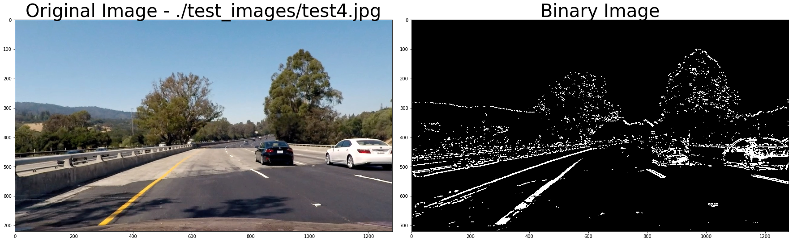
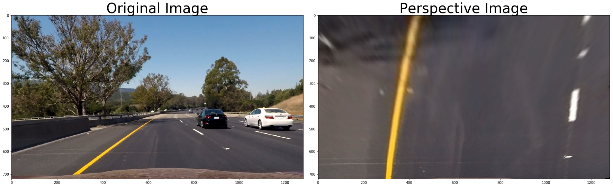
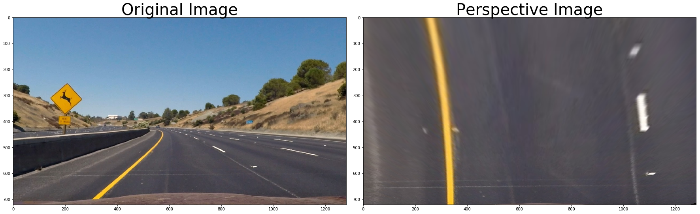
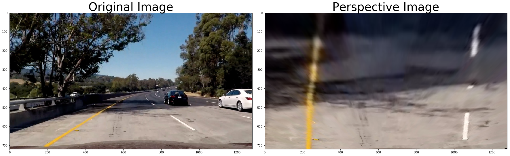

# Advanced Lane Finding Project

The goals / steps of this project are the following:

- Compute the camera calibration matrix and distortion coefficients given a set of chessboard images.
- Apply a distortion correction to raw images.
- Use color transforms, gradients, etc., to create a thresholded binary image.
- Apply a perspective transform to rectify binary image ("birds-eye view").
- Detect lane pixels and fit to find the lane boundary.
- Determine the curvature of the lane and vehicle position with respect to center.
- Warp the detected lane boundaries back onto the original image.
- Output visual display of the lane boundaries and numerical estimation of lane curvature and vehicle position.

## Camera Calibration

The code for camera clibration is located in the **Cameral Calibration with OpenCV** section of the AdvancedLaneFinding.ipynb
To perfrom the calibration we need a set of objectpoints and corresponding imagepoints. We use OpenCV findChessboardCorners
function to automatically identify imagepoints from the set of the previously collected chessboard images.

The images with drawn internal corners are presented in the image below:


For some of the images the cv2.findChessboardCorners failed to identify the corners.
Inspecting those images reveals that the images do not have the complete set (9x6) of the internal corners.

Once the set of objectpoints and corresponding imagepoints were collected, we used OpenCV calibrateCamera function
to generate the camera matrix and distortion coefficients, which may be used to undistort images produced by the camera.

Result of application of undistortion to one of the calibration images is presented below:


# Pipeline (single image)

## Undistortion

The image below demonstrates application of undistortion to one of the test images:


## Creating thresholded binary image

To create a binary image I have considered application of the following methods:

- Perform GaussianBlur transformation to smooth the image
- Apply the combination of the sobel gradient thresholds and color gradients in RGB and HLS color spaces

I have experimented with different combinations of the sobel gradients and R and S color channels separately in the corresponding
sections of the AdvancedLaneFinding.ipynb.

Based on the results of the experiments, I have decided on the following combination of the sobel gradients and color thresholding:

- Absolute sobel threshold direction x: (10, 255)
- Absolute sobel threshold direction y: (60, 255)
- Magnitude of the gradient threshold: (40,255)
- Direction of the gradient threshold: (0.6, 1.10)
- H-color channel threshold: (180, 255)

The function **to_binary_image** implements the complete transformation of the image to the binary.
The results of application this function to test images is presented below:





## Perspective transformation of the image

To performa the perspective transformation we need a set of 4 points coordinates in the original image and
desired coordinates of the corresponding points in the destination image.

I have used provided image with straight lines to chose the source and destination coordinates of the points.

Through the experiments in **Perspective transformation of the image** section I have ended up with the following
set of coordinates:


```python
src_perspective = np.float32([(594, 450),
                              (688, 450),
                              (1050, 680),
                              (250, 680)])

dst = np.float32([(465, 0),
                  (w-465, 0),
                  (w-465, h),
                  (465, h)])

```

Where w,h are width and height of the image.

Results of application of the perspective transformation to the test images are visualized below:











## Finding lanes

Finding the lanes implemented in two functions: **find_lanes_polyfit** and **find_lanes_polyfit_using_prev_fit**
The former function finds lanes without any previous information. The latter uses the best fit from the previous frames
to search for lanes in the current frame.

Implementation of both functions mostly follows the corresponding code form the Udacity materials.

**find_lanes_polyfit** starts with calculating the histogram of the bottom half of the image. It finds the maximum peaks
in the left and right halves of the image, considering those as starting points of the left and right lanes. Using windows
of predefined width and height it then searches for nonzero points within bounds of the windows. Finally it uses **numpy.polyfit**
function to fit second order polynomial to the identified set of pixels.

The result of identifying lanes using this method on one of the test images is presented below:


**find_lanes_polyfit_using_prev_fit** uses the same technique, except it starts searching of the lanes within the bounds around the fit from
the previous frame.


## Calculating the curvature and distance from the center of the lane


Calculation of the curvature and distance from the center is performed by functions **calculate_curvature**
and **calculate_center_distance**, and follows the instructions from the Udacity materials.

I have the following parameters to translate from pixels to meters:

```python

ym_per_pix = 30/720 # meters per pixel in y dimension
xm_per_pix = 3.7/400 # meters per pixel in x dimension

```

## Drawing the lane on top of the image

The implementation of the drawing lane is provided by function **draw_lane**.
The function **draw_curvature_distance** overlays curvature and distance from the center of the lane.

The results of application of the complete pipeline to one of the test images is below:


## Pipeline (video)

Here is the [link to the output from the video pipeline](project_video_output.mp4)

## Discussion

The overall results of application of the method to the challenging video samples clearly indicate that developed pipeline is not
robust enough. Based on the analysis of the problems in the outputs, the probable weak point of the algorithm is the transformation
of the image to binary image. There are two issues in the transformation:

- Picking up noise
- Not picking up the lanes

Finding better thresholds on more complex test images could probably help to significantly improve the algorithm.
Another approach which could probably improve the outcome would be to apply more image preprocessing techniques before
transforming the image to binary.

